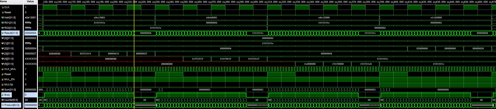

# SME309 Lab Report - Processor with Multicycle Multiplier

> By HUANG Guanchao, SID 11912309, from the School of Microelectronics. All of the materials, including source code, diagrams and the report itself can be retrieved at [my GitHub repo](https://github.com/kommunium/sme-309).
>
> This implementation of processor is based on the previous single cycle version, visit  [ARMv3 Single Cycle Processor](https://github.com/kommunium/sme-309/releases/tag/v1.0) for source code, and [SME309 Lab Report - Single Cycle Processor](https://github.com/kommunium/sme-309/blob/main/SME309-Lab-Report.md) for documentation.
>
> - Code edited in [VSCode](https://code.visualstudio.com), with support from extensions [TerosHDL](https://terostechnology.github.io/) and [FPGA Develop Support](https://marketplace.visualstudio.com/items?itemName=sterben.fpga-support).
> - Compiled and simulated with Vivado 2021.1, ModelSim 2020.1
> - Testbench assembled using Keil uVision 5

[toc]

## Instruction Set Architecture

The processor now can support 4 extra instructions:

- `SMUL`
- `SMULS`
- `UMUL`
- `UMULS`

To support the additional instructions, the `ALUControl` signal is extended to 3 bits. For the previous supported instructions, a `0` bit is appended at the higher bit of the `ALUControl` signal. The control signals are now allocated as shown in the table below.

<table>
  <tr align="center">
    <th><code>ALUOp</code>
    <th><code>Funct[4:1]</code> (<code>cmd</code>)
    <th><code>Funct[0]</code> (<code>S</code>)
    <th>Type
    <th><code>ALUControl[2:0]</code>
    <th><code>FlagW[1:0]</code>
  </tr>
  <tr align="center">
    <td><code>0</code>
    <td><code>xxxx</code>
    <td><code>x</code>
    <td>Not DP
    <td><code>000</code>
    <td><code>00</code>
  </tr>
  <tr align="center">
    <td rowspan=8><code>1</code>
    <td rowspan=2><code>0100</code>
    <td><code>0</code>
    <td rowspan=2><code>ADD</code>
    <td rowspan=2><code>000</code>
    <td><code>00</code>
  </tr>
  <tr align="center">
    <td><code>1</code>
    <td><code>11</code>
  </tr>
  <tr align="center">
    <td rowspan=2><code>0010</code>
    <td><code>0</code>
    <td rowspan=2><code>SUB</code>
    <td rowspan=2><code>001</code>
    <td><code>00</code>
  </tr>
  <tr align="center">
    <td><code>1</code>
    <td><code>11</code>
  </tr>
  <tr align="center">
    <td rowspan=2><code>0000</code>
    <td><code>0</code>
    <td rowspan=2><code>AND</code>
    <td rowspan=2><code>010</code>
    <td><code>00</code>
  </tr>
  <tr align="center">
    <td><code>1</code>
    <td><code>10</code>
  </tr>
  <tr align="center">
    <td rowspan=2><code>1100</code>
    <td><code>0</code>
    <td rowspan=2><code>ORR</code>
    <td rowspan=2><code>011</code>
    <td><code>00</code>
  </tr>
  <tr align="center">
    <td><code>1</code>
    <td><code>10</code>
  </tr>
  <tr align="center">
    <td rowspan=4><code>1</code>
    <td rowspan=2><code>1110</code>
    <td><code>0</code>
    <td rowspan=2><code>SMUL</code>
    <td rowspan=2><code>101</code>
    <td><code>00</code>
  </tr>
  <tr align="center">
    <td><code>1</code>
    <td><code>10</code>
  </tr>
  <tr align="center">
    <td rowspan=2><code>0111</code>
    <td><code>0</code>
    <td rowspan=2><code>UMUL</code>
    <td rowspan=2><code>100</code>
    <td><code>00</code>
  </tr>
  <tr align="center">
    <td><code>1</code>
    <td><code>10</code>
  </tr>
</table>

---

## Principle of Multiplier

The principle of multicycle multiplier for unsigned numbers is stated clearly in *Computer Organization and Design: The Hardware/Software Interface* by David A. Patterson and John L. Hennessy. Here we focus on the the support for signed numbers multiplication. The following analysis is mainly based on the article [Multiplication Examples Using the Fixed-Point Representation](https://www.allaboutcircuits.com/technical-articles/multiplication-examples-using-the-fixed-point-representation/) by [Dr. Steve Arar](https://www.allaboutcircuits.com/author/dr-steve-arar), and [Binary multiplier --- Wikipedia, The Free Encyclopedia](https://en.wikipedia.org/wiki/Binary_multiplier).

In the unsigned multiplication case, what we are doing is essentially multiplying the multiplicand with the multiplier, as each bit in the multiplier indicates a power of 2, then add up the partial products. Therefore, to support for signed multiplication, since the signed number is represented with 2's complement, we simply need to take care of the sign bit, which represents the negative of a power of 2.

While we shifting the multiplicand,

- If the multiplicand is multiplied with a non-sign bit in the multiplier, we need sign extension to keep the sign of the partial product consistent with the multiplicand.
- At the final step, the multiplicand is multiplied with the sign bit of the multiplier.
  - If the sign bit is 0, the partial product is 0 and will not be added.
  - If the sign bit is 1, it represents $-2^{N-1}$, and can be interpreted as the multiplicand multiplied by $2^{N-1}$, then multiplied by $-1$. That is, we need to take 2's complement again on the partial product.

---

## Processor Implementation

### Multiplier

The core part of the new processor design is the multiplier. The following input ports are defined for the multiplier.

- `input CLK_MUL`
  Dedicated clock signal for multicycle multiply, the frequency is much higher than the CPU clock.
- `input Reset`
  Connected to the `Reset` of the ARM processor, and is also used for reinitialize the multiplier when one multiplication instruction is done.
- `input MUL_EN`
  Multi-cycle Enable. This signal is asserted when an instruction with a multi-cycle operation is detected.
- `input MULOp`
  Multi-cycle Operation. "High" for signed multiplication, "low" for unsigned multiplication.
- `input [31:0] Operand1`
  Multiplicand A.
- `input [31:0] Operand2`
  Multiplier B.
- `input [31:0] Sum`
  Provides interface to the 32bit full-adder in ALU
- `output [31:0] MAddInA`
  Provides interface to the 32bit full-adder in ALU
- `output [31:0] MAddInB`
  Provides interface to the 32bit full-adder in ALU
- `output MCin`
  Provides interface to the 32bit full-adder in ALU
- `output [31:0] Result`
  LSW(Least Significant Word) of the Product
- `output reg Busy`
  Set immediately when Start is set. Cleared when the Results become ready. This bit can be used to stall the processor while multi-cycle operations are on.(i.e. keep the PC from fetching next instruction if the multicycle multiply is not finished)

A 6-bit `counter` signal is defined for detecting the end of the multiplication.

When the `MUL_EN` signal is deasserted, or when `Reset` signal is asserted, the multiplier is initialized, that is, `Busy` and `counter` are reset to 0.

```verilog
reg [5:0] counter;
//! Initialize
always @(*)
  if(~MUL_EN | Reset)
    begin
      Busy <= 0'b0;
      counter <= 6'b000000;
    end
```

A shift register of 64bits is implemented for the shifting and summation fo partial products. When multiplication operation starts, the `Product` register is initialized with the multiplier aligned to its LSW, and `Busy` is asserted. Note that, `~counter[5]` is required for the initialization process to be triggered, since we need to distinguish between the real start of multiplication and the state where the multiplication is done, but a new instruction has not come yet.

```verilog
reg [63:0] Product;
//! Detect the start of the multiplication
always @(posedge CLK_MUL)
  if (MUL_EN & ~Busy & ~counter[5])
    begin
      Busy <= 0'b1;
      Product <= {{32'b0}, Operand2};
      counter <= 6'b000000;
    end
```

When `counter[5]` is high, 32 shifts are performed, and the multiplication result is ready.

```verilog
//! Detect the end of the multiplication
always @(*)
  if (counter[5])
    Busy <= 0'b0;
```

For performing the multiplication, in each iteration, an addition and a shift is done at the same clock cycle, and the `counter` is increased.

```verilog
//! Do multiplication
always @(posedge CLK_MUL)
  if (MUL_EN & Busy)
    begin
      Product <= {{MULOp & Operand1[31]}, Sum, Product[31:1]};
      counter <= counter + 6'b000001;
    end
```

In this multiplier design, we reused the 32bit full-adder in the previously designed ALU. The first addition operand `MAddInA` is simply defined as the MSW of the `Product` registers, namely the current sum of all partial products. The second addition operand `MAddInB` is defined so that when the multiplication is signed, and the multiplier is a negative number, and when the final partial product is being calculated, `MAddInB` is inverted. At such case, `MCin` is asserted, hence we have created the 2's complement, namely the negative of the partial product.

```verilog
//!  Defines the partial product
assign MAddInA = Product[63:32];
assign MAddInB = ({32{&counter[4:0] & MULOp & Operand2[31]}}) ^ (Operand1 & {32{Product[0]}});
assign MCin = &counter[4:0] & MULOp & Operand2[31];
assign Result = Product[31:0];
```

### ALU

The multiplier is instantiated in the ALU, hence we also need to modify the design of which. `ALUControl` signal is extended to 3bits, two input port, `CLK_MUL` and `MReset`, and an output port `Busy` is added.

```verilog
module ALU(
    input [2:0] ALUControl,
    ...
    input CLK_MUL,
    input MReset,
    ...
    output Busy,
  );
```

In this design, the control signals `MUL_EN` and the `MULOp` are decoded inside the ALU.

```verilog
//! Define control signal for the multiplier.
assign MUL_EN = ALUControl[2:1] == 2'b10;
assign MULOp = ALUControl[0];
```

In the multiplication, multiplier takes control of the full-adder in the ALU.

```verilog
//! In multiplication, Multiplier takes control of the full-adder
always @(*)
  begin
    if (MUL_EN)
      begin
        AddInA = MAddInA;
        AddInB = MAddInB;
        if (MULOp)
          Cin = MCin;
      end
    else
      ...
  end
```

In such case, the result of the ALU is also redefined to be taken control by the multiplier, and the cases are also modified to conform with the new encoding scheme for `ALUControl`.

```verilog
//! Result define
always  @(*)
  begin: Result_Define
    case (ALUControl)
      3'b011:
        Result = A | B;
      3'b010:
        Result = A & B;
      3'b100:
        Result = MResult;
      3'b101:
        Result = MResult;
      default:
        Result = Sum;
    endcase
  end
```

### Decoder

The decoder is modified to support the extra output control signals.

```verilog
output reg [2:0] ALUControl,
output reg MUL_EN,
output reg MULop
```

The `case` statement is modified to conform with the new decoding scheme and the extended `ALUControl` signal.

```verilog
always @(*)
  begin
    case ({ALUOp, Instr[24:20]}) // ALUOp, Funct4:1, Funct0
      6'b101000 :
        ALU = 5'b00000; // ADD
      6'b101001 :
        ALU = 5'b00011; // ADDS
      6'b100100 :
        ALU = 5'b00100; // SUB
      6'b100101 :
        ALU = 5'b00111; // SUBS
      6'b100000 :
        ALU = 5'b01000; // AND
      6'b100001 :
        ALU = 5'b01010; // ANDS
      6'b111000 :
        ALU = 5'b01100; // ORR
      6'b111001 :
        ALU = 5'b01110; // ORRS
      6'b111100:
        ALU = 5'b10100; // SMUL
      6'b111101:
        ALU = 5'b10110; // SMULS
      6'b101110:
        ALU = 5'b10000; // UMUL
      6'b101111:
        ALU = 5'b10010; // UMULS
      default:
        ALU = 5'b00000; // Not DP
    endcase
```

### Control Unit

The only modification to the Control Unit is the length of `ALUControl`.

### Program Counter

Program Counter now takes the `Busy` signal, so that when multi-cycle multiplication is ongoing, new instructions will not be fetched.

```verilog
always @(posedge CLK)
  if (Reset)
    PC <= 0;
  else if (~Busy)
    PC <= next_PC;
```

### Extra Connections in the Processor

Some extra connections are added in the top of the processor. A new input `CLK_MUL` is added.

When `Reset` for the processor is asserted, the `MReset` for multiplier is also asserted. Beyond that, the signal `MReset` is also used to reinitialize the state of the multiplier, for reasons stated in [design of Multiplier](#multiplier).

```verilog
always @(posedge CLK)
  if (ALUControl[2] & ~Busy)
    MReset <= 1'b1;
  else
    MReset <= Reset;
```

Other new signals are also connected in the too module.

---

## Testbench

Due to the time limitations, here I only used a small range of examples to test the multiplication function. Before performing simulation for the whole processor, some other testbench for multiplier and ALU with multiplier integrated are done to make sure that each individual modules functions correctly.

### Whole Processor Testbench Design

Since `UMUL` and `SMUL` instructions are not supported natively in the ARMv3 ISA, I used `ADD` instruction instead in composing and assembling the testbench.

```nasm
AREA TEST, CODE, READONLY, ALIGN=9 
    ENTRY

  ; Initialize data
  AND R0, R0, #0      ; initialize R0 as 0, R0 = 0x00000000
  LDR R0, [R0, #1]    ; Load R0 = 0x00000002
  LDR R1, [R0]        ; Load R1 = 0xFFFFFFFE
  
  ; Unsigned multiplication test
  ADD R2, R0, R0  ; R2 = 2 * 2 = 4
  ADD R3, R1, R1  ; R3 = -2 * -2 = 4
  ADD R4, R0, R1  ; R4 = 2 * -2 = 4
  ADD R5, R1, R0  ; R5 = -2 * 2 = 4
  
  ; Signed multiplication test
  ADD R2, R0, R0  ; R2 = 2 * 2 = 4
  ADD R3, R1, R1  ; R3 = -2 * -2 = 4
  ADD R4, R0, R1  ; R4 = 2 * -2 = -4
  ADD R5, R1, R0  ; R5 = -2 * 2 = -4

  END
```

The assembled Hex and Bin instructions are shown in the table below.

| Assembly                |     Hex      |                 Binary                 |
| :---------------------- | :----------: | :------------------------------------: |
| `AND R0,R0,#0x00000000` | `0xE2000000` | `0b1110001_0000_000000000000000000000` |
| `LDR R0,[R0,#0x0001]`   | `0xE5900001` | `0b1110010_1100_100000000000000000001` |
| `LDR R1,[R0,#0x0000]`   | `0xE5901000` | `0b1110010_1100_100000001000000000000` |
| `ADD R2,R0,R0`          | `0xE0802000` | `0b1110000_0100_000000010000000000000` |
| `ADD R3,R1,R1`          | `0xE0813001` | `0b1110000_0100_000010011000000000001` |
| `ADD R4,R0,R1`          | `0xE0804001` | `0b1110000_0100_000000100000000000001` |
| `ADD R5,R1,R0`          | `0xE0815000` | `0b1110000_0100_000010101000000000000` |
| `ADD R2,R0,R0`          | `0xE0802000` | `0b1110000_0100_000000010000000000000` |
| `ADD R3,R1,R1`          | `0xE0813001` | `0b1110000_0100_000010011000000000001` |
| `ADD R4,R0,R1`          | `0xE0804001` | `0b1110000_0100_000000100000000000001` |
| `ADD R5,R1,R0`          | `0xE0815000` | `0b1110000_0100_000010101000000000000` |

We may modify the `Funct[4:1]` bits, namely the `Instr[24:21]` bits to create `UMUL` and `SMUL` instructions.

| Assembly        |     Hex      |                 Binary                 |
| :-------------- | :----------: | :------------------------------------: |
| `UMUL R2,R0,R0` | `0xE0E02000` | `0b1110000_0111_000000010000000000000` |
| `UMUL R3,R1,R1` | `0xE0E13001` | `0b1110000_0111_000010011000000000001` |
| `UMUL R4,R0,R1` | `0xE0E04001` | `0b1110000_0111_000000100000000000001` |
| `UMUL R5,R1,R0` | `0xE0E15000` | `0b1110000_0111_000010101000000000000` |
| `SMUL R2,R0,R0` | `0xE1C02000` | `0b1110000_1110_000000010000000000000` |
| `SMUL R3,R1,R1` | `0xE1C13001` | `0b1110000_1110_000010011000000000001` |
| `SMUL R4,R0,R1` | `0xE1C04001` | `0b1110000_1110_000000100000000000001` |
| `SMUL R5,R1,R0` | `0xE1C15000` | `0b1110000_1110_000010101000000000000` |

The instruction memory is initialized as follows.

```verilog
initial
  begin
    INSTR_MEM[0] = 32'hE2000000;  // AND       R0,R0,#0x00000000
    INSTR_MEM[1] = 32'hE5900001;  // LDR       R1,[R0,#0x0001]
    INSTR_MEM[2] = 32'hE5901000;  // LDR       R2,[R0,#0x0000]
    INSTR_MEM[3] = 32'hE0E02000;  // UMUL      R2,R0,R0
    INSTR_MEM[4] = 32'hE0E13001;  // UMUL      R3,R1,R1
    INSTR_MEM[5] = 32'hE0E04001;  // UMUL      R4,R0,R1
    INSTR_MEM[6] = 32'hE0E15000;  // UMUL      R5,R1,R0
    INSTR_MEM[7] = 32'hE1C02000;  // SMUL      R2,R0,R0
    INSTR_MEM[8] = 32'hE1C13001;  // SMUL      R3,R1,R1
    INSTR_MEM[9] = 32'hE1C04001;  // SMUL      R4,R0,R1
    INSTR_MEM[10] = 32'hE1C15000; // SMUL      R5,R1,R0
  end
```

Correspondingly, the data memory is initialized as follows.

```verilog
initial
  begin
    DATA_MEM[0] = 32'h00000000;
    DATA_MEM[1] = 32'h00000002;
    DATA_MEM[2] = 32'hFFFFFFFE;
  end
```

### Whole Processor Test Result

According to the waveform, the unsigned multiplication for any combination of 2 and -2 are performed correctly.



Similarly, the signed multiplication for any combination of 2 and -2 are performed correctly.


We may dive in to see the details of signed multiplication. In the last partial product of signed multiplication with negative multiplier, `MAddInB` is inverted, and `MCin` is asserted, hence created the 2's complement of the partial product. Thus we have obtained the correct result for signed multiplication.


Another subtlety is that, once an new multiplication instruction is fetched, the `MReset` signal for the multiplier is shortly asserted for one cycle, and the rising edge of `Busy` comes shortly after that of `MReset`, this design helps the multiplier to be relaunched correctly.


## Conclusion

The multiplier and the processor are functioning as expected. The process for designing and debugging is painful but still with a lot of fun. If time permits, more research and optimization can be done.
