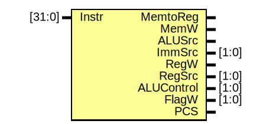
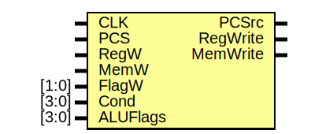

# SME309 Lab Report - Single Cycle Processor

> By HUANG Guanchao, SID 11912309, from the School of Microelectronics. All of the materials, including source code, diagrams and the report itself can be retrieved at [my GitHub repo](https://github.com/kommunium/sme-309).
>
> - Code edited in [VSCode](https://code.visualstudio.com), with support from extensions [TerosHDL](https://terostechnology.github.io/) and [FPGA Develop Support](https://marketplace.visualstudio.com/items?itemName=sterben.fpga-support).
> - Compiled and simulated with Vivado 2021.1, ModelSim 2020.1
> - Testbench assembled using Keil uVision 5

[toc]

## Instruction Set Architecture

The single cycle processor is implemented based on reduced 32bit ARMv3 instruction set architecture, which provides support for the following instructions:

- Datapath instructions
  - `ADD`
  - `SUB`
  - `AND`
  - `ORR`
  
  Immediate number with rotation, register with shift, and register-shifted register are not supported for `Src2`.
- Branching instruction `B`
- Memory instructions
  - `LDR`
  - `STR`
  
  Register bias, as well as preindex and postindex for accessing memory are not supported.

Instructions with conditions and flags setting are supported.

The register file is of 16 registers, with `R15` dedicated for program counter.

---

## Processor Implementation

The processor diagram is shown below.

> This diagram is redrawn with [draw.io](https://draw.io/)


> Some of the following elaborations for entities are generated with TerosHDL documentation tool.

### Program Counter

**File**: `ProgramCounter.v`


- Ports

| Port name   | Direction | Type   |
| ----------- | --------- | ------ |
| `CLK`       | input     |        |
| `Reset`     | input     |        |
| `PCSrc`     | input     |        |
| `Result`    | input     | [31:0] |
| `PC`        | output    | [31:0] |
| `PC_Plus_4` | output    | [31:0] |

- Signals

| Name      | Type       | Description                                             |
| --------- | ---------- | ------------------------------------------------------- |
| `next_PC` | reg [31:0] | Intermediate wire `next_PC`                             |
| `PC_tmp`  | reg [31:0] | Sequential, synchronous reset, and updates `current_PC` |

- Verilog Implementation

```verilog
module ProgramCounter (
    input CLK,
    input Reset, // reset is high-active
    input PCSrc, // PC source
    input [31:0] Result, // From ALU

    output [31:0] PC,
    output [31:0] PC_Plus_4
  );


  //! Intermediate wire `next_PC`
  reg [31:0] next_PC;
  //! Combinational, defines `PC_Plus_4`
  assign PC_Plus_4 = PC + 4;


  //! Sequential, synchronous reset, and updates `current_PC`
  reg [31:0] PC_tmp;

  always @(posedge CLK)
    if (Reset == 1'b1)
      PC_tmp <= 0;
    else
      PC_tmp <= next_PC;

  assign PC = PC_tmp;

  //! Combinational, defines `next_PC`
  always @(*)
    if (PCSrc == 1'b0)
      next_PC = PC_Plus_4;
    else
      next_PC = Result;


endmodule
```

### Register File

**File**: `RegisterFile.v`


- Ports

| Port name | Direction | Type   |
| --------- | --------- | ------ |
| `CLK`     | input     |        |
| `WE3`     | input     |        |
| `A1`      | input     | [3:0]  |
| `A2`      | input     | [3:0]  |
| `A3`      | input     | [3:0]  |
| `WD3`     | input     | [31:0] |
| `R15`     | input     | [31:0] |
| `RD1`     | output    | [31:0] |
| `RD2`     | output    | [31:0] |

- Signals

| Name          | Type       |
| ------------- | ---------- |
| `RegBankCore` | reg [31:0] |

- Verilog Implementation

```verilog
// RegisterFile.v
module RegisterFile(
    input CLK,
    input WE3, // high active
    input [3:0] A1, // Read index1
    input [3:0] A2, // Read index2
    input [3:0] A3, // Write index
    input [31:0] WD3,// Write data
    input [31:0] R15, // R15 Data in

    output reg [31:0] RD1, // Read data1
    output reg [31:0] RD2 // Read data2
  );


  reg [31:0] RegBankCore[0:14];


  //! Sequential, writes `WD3` into `RegBankCore` at the rising edge of clk
  always @(posedge CLK)
    if (WE3)
      RegBankCore[A3] <= WD3;


  //! Combinational, defines `RD1`
  always @(*)
    if (A1 == 4'b1111)
      RD1 = R15;
    else
      RD1 = RegBankCore[A1];


  //! Combinational, defines `RD2`
  always @(*)
    if (A2 == 4'b1111)
      RD2 = R15;
    else
      RD2 = RegBankCore[A2];


endmodule
```

### Decoder

**File**: `Decoder.v`



- Ports

| Port name    | Direction | Type   |
| ------------ | --------- | ------ |
| `Instr`      | input     | [31:0] |
| `MemtoReg`   | output    |        |
| `MemW`       | output    |        |
| `ALUSrc`     | output    |        |
| `ImmSrc`     | output    | [1:0]  |
| `RegW`       | output    |        |
| `RegSrc`     | output    | [1:0]  |
| `ALUControl` | output    | [1:0]  |
| `FlagW`      | output    | [1:0]  |
| `PCS`        | output    |        |

- Signals

| Name     | Type      |
| -------- | --------- |
| `ALUOp`  | reg       |
| `Branch` | reg       |
| `Main`   | reg [9:0] |
| `ALU`    | reg [3:0] |

- Verilog Implementation

```verilog
module Decoder(
    input [31:0] Instr,

    output reg MemtoReg,
    output reg MemW,
    output reg ALUSrc,
    output reg [1:0] ImmSrc,
    output reg RegW,
    output reg [1:0] RegSrc,
    output reg [1:0] ALUControl,
    output reg [1:0] FlagW,
    output reg PCS
  );

  reg ALUOp;
  reg Branch;

  reg [9:0] Main;
  //! Main Decoder
  always @(*)
    begin
      casex ({Instr[27:25], Instr[20]}) // Op, Funct5, Funct0
        4'b000x :
          Main = 10'b0000xx1001; // DP reg
        4'b001x :
          Main = 10'b0001001x01; // DP imm
        4'b01x0 :
          Main = 10'b0x11010100; // STR
        4'b01x1 :
          Main = 10'b0101011x00; // LDR
        default:
          Main = 10'b1001100x10; // B
      endcase
      {Branch, MemtoReg, MemW, ALUSrc, ImmSrc, RegW, RegSrc, ALUOp} = Main;
    end

  reg [3:0] ALU;
  //! ALU Decoder
  always @(*)
    begin
      case ({ALUOp, Instr[24:20]}) // ALUOp, Funct4:1, Funct0
        6'b101000 :
          ALU = 4'b0000; // ADD
        6'b101001 :
          ALU = 4'b0011; // ADDS
        6'b100100 :
          ALU = 4'b0100; // SUB
        6'b100101 :
          ALU = 4'b0111; // SUBS
        6'b100000 :
          ALU = 4'b1000; // AND
        6'b100001 :
          ALU = 4'b1010; // ANDS
        6'b111000 :
          ALU = 4'b1100; // ORR
        6'b111001 :
          ALU = 4'b1110; // ORRS
        default:
          ALU = 4'b0000; // Not DP
      endcase
      {ALUControl, FlagW} = ALU;
    end

  //! PC Logic
  always @(*)
    PCS = Branch;

endmodule
```

### Conditional Logic

**File**: `CondLogic.v`



- Ports

| Port name  | Direction | Type  |
| ---------- | --------- | ----- |
| `CLK`      | input     |       |
| `PCS`      | input     |       |
| `RegW`     | input     |       |
| `MemW`     | input     |       |
| `FlagW`    | input     | [1:0] |
| `Cond`     | input     | [3:0] |
| `ALUFlags` | input     | [3:0] |
| `PCSrc`    | output    |       |
| `RegWrite` | output    |       |
| `MemWrite` | output    |       |

- Signals

| Name     | Type |
| -------- | ---- |
| `CondEx` | reg  |
| `N`      | reg  |
| `Z`      | reg  |
| `C`      | reg  |
| `V`      | reg  |

- Verilog Implementation

```verilog
module CondLogic(
    input CLK,
    input PCS,
    input RegW,
    input MemW,
    input [1:0] FlagW,
    input [3:0] Cond,
    input [3:0] ALUFlags,

    output PCSrc,
    output RegWrite,
    output MemWrite);

  reg CondEx;
  reg N = 0, Z = 0, C = 0, V = 0;
  wire [1:0] FlagWrite = FlagW[1:0] & {2{CondEx}};

  //! Output stage
  assign {PCSrc, RegWrite, MemWrite} = {PCS, RegW, MemW} & {3{CondEx}};


  //! Flags Register update
  always @(posedge CLK)
    begin
      if (FlagWrite[1])
        {N, Z} <= ALUFlags[3:2];
      if (FlagWrite[0])
        {C, V} <= ALUFlags[1:0];
    end


  //! Condition Check
  always @(*)
    case (Cond)
      4'b0000:
        CondEx = Z; // EQ -Equal
      4'b0001 :
        CondEx = !Z; // NE - Not equal
      4'b0010 :
        CondEx = C; // CS / HS- Carry set / Unsigned higher or same
      4'b0011 :
        CondEx = !C; // CC / LO - Carry clear / Unsigned lower
      4'b0100 :
        CondEx = N; // MI - Minus / Negative
      4'b0101 :
        CondEx = !N; // PL - Plus / Positive of zero
      4'b0110 :
        CondEx = V; // VS - Overflow / Overflow set
      4'b0111 :
        CondEx = !V; // VC - No overflow / Overflow clear
      4'b1000 :
        CondEx = !V & C; // HI - Unsigned lower or same
      4'b1001 :
        CondEx = Z | !C; // LS - Unsigned lower or same
      4'b1010 :
        CondEx = !(N ^ V); // GE -  Signed greater than or equal
      4'b1011 :
        CondEx = N ^ V; // LT - Signed less than
      4'b1100 :
        CondEx = !Z & !(N ^ V); // GT - Signed greater than
      4'b1101 :
        CondEx = Z | (N ^ V); // LE - Signed less than or equal
      default:
        CondEx = 1'b1; // AL - Always / unconditional
    endcase

endmodule
```

### Control Unit

**File**: `ControlUnit.v`


- Ports

| Port name    | Direction | Type   |
| ------------ | --------- | ------ |
| `Instr`      | input     | [31:0] |
| `ALUFlags`   | input     | [3:0]  |
| `CLK`        | input     |        |
| `MemtoReg`   | output    |        |
| `MemWrite`   | output    |        |
| `ALUSrc`     | output    |        |
| `ImmSrc`     | output    | [1:0]  |
| `RegWrite`   | output    |        |
| `RegSrc`     | output    | [1:0]  |
| `ALUControl` | output    | [1:0]  |
| `PCSrc`      | output    |        |

- Signals

| Name    | Type       |
| ------- | ---------- |
| `Cond`  | wire [3:0] |
| `PCS`   | wire       |
| `RegW`  | wire       |
| `MemW`  | wire       |
| `FlagW` | wire [1:0] |

- Instantiations

- `CondLogic1`: `CondLogic`
- `Decoder1`: `Decoder`

- Verilog Implementation

```verilog
`include "Decoder.v"
`include "CondLogic.v"

module ControlUnit(
    input [31:0] Instr,
    input [3:0] ALUFlags,
    input CLK,

    output MemtoReg,
    output MemWrite,
    output ALUSrc,
    output [1:0] ImmSrc,
    output RegWrite,
    output [1:0] RegSrc,
    output [1:0] ALUControl,
    output PCSrc);

  wire [3:0] Cond = Instr[31:28];
  wire PCS, RegW, MemW;
  wire [1:0] FlagW;


  CondLogic CondLogic1(
              CLK,
              PCS,
              RegW,
              MemW,
              FlagW,
              Cond,
              ALUFlags,

              PCSrc,
              RegWrite,
              MemWrite);

  Decoder Decoder1(
            Instr,

            MemtoReg,
            MemW,
            ALUSrc,
            ImmSrc,
            RegW,
            RegSrc,
            ALUControl,
            FlagW,
            PCS);

endmodule
```

### ALU

**File**: `ALU.v`


- Ports

| Port name    | Direction | Type   |
| ------------ | --------- | ------ |
| `A`          | input     | [31:0] |
| `B`          | input     | [31:0] |
| `ALUControl` | input     | [1:0]  |
| `Result`     | output    | [31:0] |
| `ALUFlags`   | output    | [3:0]  |

- Signals

| Name    | Type        | Description |
| ------- | ----------- | ----------- |
| `AddIn` | reg [31:0]  | FullAdder32 |
| `Sum`   | wire [31:0] |             |
| `Cout`  | wire        |             |
| `Cin`   | wire        |             |
| `N`     | reg         |             |
| `Z`     | reg         |             |
| `C`     | reg         |             |
| `V`     | reg         |             |

- Verilog Implementation

```verilog
module ALU(
    input [31:0] A,
    input [31:0] B,
    input [1:0] ALUControl,

    output reg [31:0] Result,
    output [3:0] ALUFlags
  );


  //! FullAdder32
  reg [31:0] AddIn;
  wire [31:0] Sum;
  wire Cout;
  wire Cin = ALUControl[0];
  FullAdder32 fulladder(A, AddIn, Cin, Sum, Cout);

  //! Result
  always  @(*)
    begin: Result_Define
      if (Cin)
        AddIn = ~B;
      else
        AddIn = B;

      case (ALUControl)
        2'b11:
          Result = A | B;
        2'b10:
          Result = A & B;
        default:
          Result = Sum;
      endcase
    end

  reg N, Z, C, V;
  //! Flags
  always @(*)
    begin: Flags_Set
      Z = ~(|Result);
      N = Result[31];
      C = ~ALUControl[1] & Cout;
      V = ~ALUControl[1] & (A[31] ^ Sum[31]) & ~(A[31] ^ B[31] ^ Cin);
    end

  assign ALUFlags = {N, Z, C, V};

endmodule

module FullAdder1(
    input A,
    input B,
    input Cin,
    output Sum,
    output Cout);

  assign Sum = A ^ B ^ Cin;
  assign Cout = (A & B) | (A ^ B) & Cin;
endmodule

module FullAdder32 (
    input [31:0] A,
    input [31:0] B,
    input Cin,
    output [31:0] Sum,
    output Cout);

  wire [31:0] Cout_tmp;

  FullAdder1 fulladder0(
               A[0],
               B[0],
               Cin,
               Sum[0],
               Cout_tmp[0]);

  genvar i;
  generate
    for(i = 1; i <= 31; i = i + 1)
      begin: adder_gen
        FullAdder1  fulladder(
                      .A(A[i]),
                      .B(B[i]),
                      .Cin(Cout_tmp[i - 1]),
                      .Sum(Sum[i]),
                      .Cout(Cout_tmp[i]));
      end
  endgenerate

  assign Cout = Cout_tmp[31];
endmodule
```

### Extend

**File**: Extend.v


- Ports

| Port name  | Direction | Type   |
| ---------- | --------- | ------ |
| `InstrImm` | input     | [23:0] |
| `ImmSrc`   | input     | [1:0]  |
| `ExtImm`   | output    | [31:0] |

### Single Cycle Processor

The previously implemented modules are connected to form the single cycle processor.

```verilog
module ARMcore_top(
    input wire CLK,
    input wire Reset
  );


  //! ALU instance
  reg [31:0] SrcA, SrcB;
  wire [1:0] ALUControl;

  wire [31:0] ALUResult;
  wire [3:0] ALUFlags;

  ALU alu(
        .A(SrcA),
        .B(SrcB),
        .ALUControl(ALUControl),

        .Result(ALUResult),
        .ALUFlags(ALUFlags)
      );


  //! ControlUnit instance
  wire [31:0] Instr;

  wire MemtoReg, MemWrite, ALUSrc;
  wire [1:0] ImmSrc;
  wire RegWrite;
  wire [1:0] RegSrc;
  wire PCSrc;

  ControlUnit controlUnit(
                .Instr(Instr),
                .ALUFlags(ALUFlags),
                .CLK(CLK),

                .MemtoReg(MemtoReg),
                .MemWrite(MemWrite),
                .ALUSrc(ALUSrc),
                .ImmSrc(ImmSrc),
                .RegWrite(RegWrite),
                .RegSrc(RegSrc),
                .ALUControl(ALUControl),
                .PCSrc(PCSrc)
              );


  //! Extend instance
  wire [23:0] InstrImm = Instr[23:0];
  wire [31:0] ExtImm;

  Extend extend(
           .InstrImm(InstrImm),
           .ImmSrc(ImmSrc),

           .ExtImm(ExtImm)
         );


  //! ProgramCounter instance
  wire [31:0] PC;
  wire [31:0] PCPlus4;
  reg [31:0] Result;

  ProgramCounter programCounter(
                   .CLK(CLK),
                   .Reset(Reset),
                   .PCSrc(PCSrc),
                   .Result(Result),

                   .PC(PC),
                   .PC_Plus_4(PCPlus4)
                 );


  //! RegisterFile instance
  reg [3:0] A1, A2;
  wire [3:0] A3 = Instr[15:12];
  wire [31:0] PCPlus8 = PCPlus4 + 4;
  wire [31:0] RD1, RD2;

  RegisterFile registerFile(
                 .CLK(CLK),
                 .WE3(RegWrite),
                 .A1(A1),
                 .A2(A2),
                 .A3(A3),
                 .WD3(Result),
                 .R15(PCPlus8),

                 .RD1(RD1),
                 .RD2(RD2)
               );

  always @(*)
    begin
      if (RegSrc[0])
        A1 = 4'b1111;
      else
        A1 = Instr[19:16];

      if (RegSrc[1])
        A2 = Instr[15:12];
      else
        A2 = Instr[3:0];

      if (ALUSrc)
        SrcB = ExtImm;
      else
        SrcB = RD2;

      SrcA = RD1;
    end


  //! InstrMem instance
  InstrMem instrMem(
             .PC(PC),
             .Instr(Instr)
           );


  //! DataMem instance
  wire [31:0] RD;
  DataMem dataMem(
            .CLK(CLK),
            .Address(ALUResult),
            .WE(MemWrite),
            .WD(RD2),

            .ReadData(RD)
          );

  always @(*)
    if (MemtoReg)
      Result = RD;
    else
      Result = ALUResult;

endmodule
```

---

## Testbench

The basic idea for the testbench is to make each of the instruction depend on the previous result, such that, if the final result is correct, it is relatively confident to conclude that the processor performs as expected for each of the instructions.

After the testbench is composed, it is than compiled using `Keil uVision5`. The corresponding instructions and data are initialized in `DataMem.v` and `InstrMem.v`. Simulation is then performed with Vivado and ModelSim.

### Testbench for Memory Operations

We first test for the memory operations, namely `LDR` and `STR` instructions. Since `MOV` instruction is not available in our implementation, we use `AND` operation to initialize `R0` with `0`, which is then used as the base address for loading data from `DATA_MEM`. The loaded values in the registers can be utilized in subsequent tests.

```nasm
; Test for LDR
AND R0, R0, #0      ; initialize R0 as 0, R0 = 0x00000000
LDR R1, [R0, #1]    ; R1 = DATA_MEM[1], 0x0000_000F
LDR R2, [R0, #2]    ; R2 = DATA_MEM[2], 0x0000_00F0
LDR R3, [R0, #3]    ; R3 = DATA_MEM[3], 0x0000_0F00
LDR R4, [R0, #4]    ; R4 = DATA_MEM[4], 0x0000_F000
LDR R5, [R0, #5]    ; R5 = DATA_MEM[5], 0x0F0F_0F0F
LDR R6, [R0, #6]    ; R6 = DATA_MEM[6], 0xF0F0_F0F0
```

The corresponding HEX value is

```nasm
0x00000000  E2000000  AND       R0,R0,#0x00000000
0x00000004  E5901001  LDR       R1,[R0,#0x0001]
0x00000008  E5902002  LDR       R2,[R0,#0x0002]
0x0000000C  E5903003  LDR       R3,[R0,#0x0003]
0x00000010  E5904004  LDR       R4,[R0,#0x0004]
0x00000014  E5905005  LDR       R5,[R0,#0x0005]
0x00000018  E5906006  LDR       R6,[R0,#0x0006]
```

The simulation waveform is shown below.


According to the waveform form from 30ns to 160ns, signal `RegBankCore` clearly shows that the expected data are initialized and loaded into `R0` through `R6`.

Afterwards, we write the data from the register file back into the data memory in reverse order.

```nasm
; Test for STR
STR R4, [R0, #1]    ; DATA_MEM[1] = R4, 0x0000_F000
STR R3, [R0, #2]    ; DATA_MEM[2] = R3, 0x0000_0F00
STR R2, [R0, #3]    ; DATA_MEM[3] = R2, 0x0000_00F0
STR R1, [R0, #4]    ; DATA_MEM[4] = R1, 0x0000_000F
```

The corresponding HEX value is

```nasm
0x0000001C  E5804001  STR       R4,[R0,#0x0001]
0x00000020  E5803002  STR       R3,[R0,#0x0002]
0x00000024  E5802003  STR       R2,[R0,#0x0003]
0x00000028  E5801004  STR       R1,[R0,#0x0004]
```

The simulation waveform is shown below.


According to the waveform form of signal `DATA_MEM` from 170ns to 240ns, the data in the data memory are modified as expected.

Thus, we may conclude that the CPU performs memory operations normally.

### Testbench for Data-Path Operations

The testbench for Data-Path operations, namely the `ADD`, `SUB`, `AND` and `ORR` instructions, consists of a sequence of instructions, each depends on the result from its preceding instruction. Both immediate number and register as `Src2` are included.

```nasm
; Test for DP instructions
ADD R7, R3, R4      ; R7 = 0x0000_FF00
ADD R7, R7, #0xFF   ; R7 = 0x0000_FFFF
SUB R7, R7, R2      ; R7 = 0x0000_FF0F
SUB R7, R7, #0xE    ; R7 = 0x0000_FF01
AND R7, R7, R5      ; R7 = 0x0000_0F01
AND R7, R7, #0xFF   ; R7 = 0x0000_0001
ORR R7, R7, R6      ; R7 = 0xF0F0_F0F1
ORR R7, R7, #0      ; R7 = 0xF0F0_F0F1
```

The corresponding HEX value is

```nasm
0x0000002C  E0837004  ADD       R7,R3,R4
0x00000030  E28770FF  ADD       R7,R7,#0x000000FF
0x00000034  E0477002  SUB       R7,R7,R2
0x00000038  E247700E  SUB       R7,R7,#0x0000000E
0x0000003C  E0077005  AND       R7,R7,R5
0x00000040  E20770FF  AND       R7,R7,#0x000000FF
0x00000044  E1877006  ORR       R7,R7,R6
0x00000048  E3877000  ORR       R7,R7,#0x00000000
0x0000004C  E3818000  ORR       R8,R1,#0x00000000
```

The simulation waveform is shown below.


According to the waveform form of signal `RegBankCore` and `Result[31:0]` from 240ns to 420ns, the final result, as well as each intermediate result of the DP instructions are expected.

### Testbench for Branch Instruction

The testbench for branch instruction consists of a loop for increment of one register and decrement of another.

```nasm
    ; Test for Branch instruction
    ORR R8, R1, #0   ; R8 = R1 = 0xF
    AND R9, R9, #0   ; R9 = 0x0
LOOP 
    SUBS R8, R8, #1  ; Update R8 and set flags, R8--
    ADD R9, R9, #1   ; Update R9, R9++
    BNE LOOP         ; LOOP until R8 = 0
```

After the loop exits, `R8` should decrease to `0`, while `R9` takes the original value of `R8` before the loop.

The corresponding HEX value is

```nasm
0x00000058  E2899000  AND       R9,R9,#0x00000000
0x00000054  E2588001  SUBS      R8,R8,#0x00000001
0x00000058  E2899001  ADD       R9,R9,#0x00000001
0x0000005C  1AFFFFFC  BNE       0x00000054
```

The simulation waveform is shown below.


According to the waveform of signal `RegBankCore`, the loop is executed and exited correctly.

### Testbench for Flags and Condition Logic

Since the amount of possible conditions for instructions is too large, we here only consider the `HI`, `LS`, `GT`, and `LE` conditions and thus have covered all 4 of the `N`, `Z`, `C`, and `V` ALU flags.

| `cond` | Mnemonic | Name                      |    `CondEx`     |
| ------ | :------: | :------------------------ | :-------------: |
| `1000` |   `HI`   | Unsigned higher           |    `!Z & C`     |
| `1001` |   `LS`   | Unsigned lower or same    |    `Z | !C`     |
| `1100` |   `GT`   | Signed greater than       | `!Z & !(N ^ V)` |
| `1101` |   `LE`   | Signed less than or equal |  `Z | (N ^ V)`  |

The assembly instructions is shown in the code blocks below.

```nasm
; Test for flags and condition
SUBS R10, R2, R1 
ANDGT R11, R0, #0       ; GT should be TRUE, R11 = 0
ADDLE R11, R11, #0xF    ; LE should be FALSE, R11 = 0
ANDHI R12, R0, #0       ; HI should be TRUE, R12 = 0
ADDLS R12, R12, #0xF    ; LS should be FALSE, R12 = 0
```

Ideally, since `R2` is greater than `R1` in both signed and unsigned arithmetics, the `SUBS` instruction would set the ALU flags as `NZCV = 0000`, and thus `GT` and `HI` hold true, `LE` and `LS` should be false.

The corresponding HEX value is

```nasm
0x00000060  E052A001  SUBS      R10,R2,R1
0x00000064  C200B000  ANDGT     R11,R0,#0x00000000
0x00000068  D28BB00F  ADDLE     R11,R11,#0x0000000F
0x0000006C  8200C000  ANDHI     R12,R0,#0x00000000
0x00000070  928CC00F  ADDLS     R12,R12,#0x0000000F
```

The simulation waveform is shown below.


According to the waveform, the values stored in the Flag registers are correct, and the conditioned instructions are executed as expected.

## Conclusion

Since the testbench has covered a large percentage of the categories of instructions, we can conclude that this implementation of single-cycle processor functions normally, though some minor bugs might take place in certain extreme cases.
