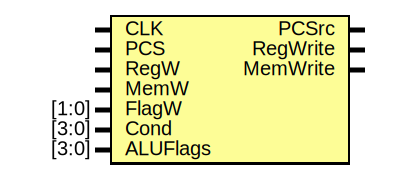

# Entity: CondLogic 

- **File**: CondLogic.v
## Diagram

## Ports

| Port name | Direction | Type  | Description |
| --------- | --------- | ----- | ----------- |
| CLK       | input     |       |             |
| PCS       | input     |       |             |
| RegW      | input     |       |             |
| MemW      | input     |       |             |
| FlagW     | input     | [1:0] |             |
| Cond      | input     | [3:0] |             |
| ALUFlags  | input     | [3:0] |             |
| PCSrc     | output    |       |             |
| RegWrite  | output    |       |             |
| MemWrite  | output    |       |             |
## Signals

| Name   | Type | Description |
| ------ | ---- | ----------- |
| CondEx | reg  |             |
| N      | reg  |             |
| Z      | reg  |             |
| C      | reg  |             |
| V      | reg  |             |
## Processes
- unnamed: ( @(posedge CLK) )
  - **Type:** always
  - **Description**
  Flags Register update
 
- unnamed: ( @(*) )
  - **Type:** always
  - **Description**
  Condition Check
 
