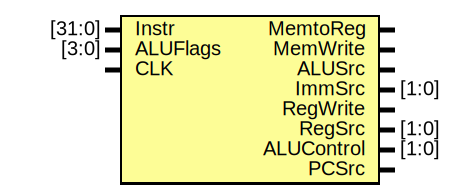

# Entity: ControlUnit 

- **File**: ControlUnit.v
## Diagram

## Ports

| Port name  | Direction | Type   | Description |
| ---------- | --------- | ------ | ----------- |
| Instr      | input     | [31:0] |             |
| ALUFlags   | input     | [3:0]  |             |
| CLK        | input     |        |             |
| MemtoReg   | output    |        |             |
| MemWrite   | output    |        |             |
| ALUSrc     | output    |        |             |
| ImmSrc     | output    | [1:0]  |             |
| RegWrite   | output    |        |             |
| RegSrc     | output    | [1:0]  |             |
| ALUControl | output    | [1:0]  |             |
| PCSrc      | output    |        |             |
## Signals

| Name  | Type       | Description |
| ----- | ---------- | ----------- |
| Cond  | wire [4:0] |             |
| PCS   | wire       |             |
| RegW  | wire       |             |
| MemW  | wire       |             |
| FlagW | wire [1:0] |             |
## Instantiations

- CondLogic1: CondLogic
- Decoder1: Decoder
