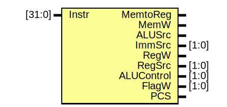

# Entity: Decoder 

- **File**: Decoder.v
## Diagram

## Ports

| Port name  | Direction | Type   | Description |
| ---------- | --------- | ------ | ----------- |
| Instr      | input     | [31:0] |             |
| MemtoReg   | output    |        |             |
| MemW       | output    |        |             |
| ALUSrc     | output    |        |             |
| ImmSrc     | output    | [1:0]  |             |
| RegW       | output    |        |             |
| RegSrc     | output    | [1:0]  |             |
| ALUControl | output    | [1:0]  |             |
| FlagW      | output    | [1:0]  |             |
| PCS        | output    |        |             |
## Signals

| Name   | Type      | Description |
| ------ | --------- | ----------- |
| ALUOp  | reg       |             |
| Branch | reg       |             |
| Main   | reg [9:0] |             |
| ALU    | reg [3:0] |             |
## Processes
- unnamed: ( @(*) )
  - **Type:** always
  - **Description**
  Main Decoder
 
- unnamed: ( @(*) )
  - **Type:** always
  - **Description**
  ALU Decoder
 
- unnamed: ( @(*) )
  - **Type:** always
  - **Description**
  PC Logic
 
