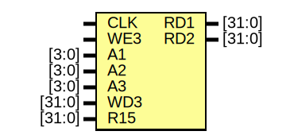

# Entity: RegisterFile 

- **File**: RegisterFile.v
## Diagram

## Ports

| Port name | Direction | Type   | Description |
| --------- | --------- | ------ | ----------- |
| CLK       | input     |        |             |
| WE3       | input     |        |             |
| A1        | input     | [3:0]  |             |
| A2        | input     | [3:0]  |             |
| A3        | input     | [3:0]  |             |
| WD3       | input     | [31:0] |             |
| R15       | input     | [31:0] |             |
| RD1       | output    | [31:0] |             |
| RD2       | output    | [31:0] |             |
## Signals

| Name        | Type       | Description |
| ----------- | ---------- | ----------- |
| RegBankCore | reg [31:0] |             |
## Processes
- unnamed: ( @(posedge CLK) )
  - **Type:** always
  - **Description**
  Sequential, writes `WD3` into `RegBankCore` at the rising edge of clk
 
- unnamed: ( @(*) )
  - **Type:** always
  - **Description**
  Combinational, defines `RD1`
 
- unnamed: ( @(*) )
  - **Type:** always
  - **Description**
  Combinational, defines `RD2`
 
